# 🧬 Aging Theory Paper Filter: AI-Powered Scientific Literature Classification

> *Stage 3: Fast and efficient filtering system for aging-theory related papers from massive scientific literature collections*

## Stage 3 GOALS

This stage focuses on **rapidly identifying and filtering aging-theory-related papers** from a massive and noisy collection (over 108,000 papers collected on Stage 1 - 2). Its objective is to serve as a precise and computationally efficient filter before more detailed downstream analyses of aging theories.

- Provide a **fast, efficient, and low-cost system** to filter out papers unlikely to be relevant to aging theory.
- Optimize for **precision** (confidence in excluded papers), as earlier stages emphasized recall and accumulated many irrelevant articles.
- Leverage additinal LLM with thinking and prompt engineering for smart, automated classification.

---

## Previous Stages

1. **Stage 1:** 
   - Collected DOIs with a high recall of potentially aging theory-related papers.
   [Stage 1 repo](https://github.com/DianaZagirova/download_agent)
2. **Stage 2:** 
   - Extracted full texts and collected detailed metadata for these papers.
   [Stage 2 repo](https://github.com/DianaZagirova/scihub_api)
3. **Stage 3 (this repo):**
   - Implements a **fast, AI-powered filtering system** to exclude not relevant papers from the large candidate set.


### 📊 Results

- **108,000+ papers processed** from high-recall search results
- **30,000 valid aging-theory papers** identified and retained (27.8%)
- **80,000 irrelevant papers** filtered out automatically (74.1%)
- **2,000 doubtful papers** flagged for manual review (1.9%)
- **Cost-effective processing** at ~$0.002 per paper using lightweight models

## 🚀 Quick Setup and Demo

### Prerequisites

- Python 3.8+
- OpenAI API key
- Virtual environment (recommended)

### Installation

```bash
# Clone the repository
git clone <repository-url>
cd llm_judge

# Create and activate virtual environment
python -m venv venv
source venv/bin/activate  # On Windows: venv\Scripts\activate

# Install dependencies
pip install -r requirements.txt

# Set up environment variables
cp env.template .env
# Edit .env with your OpenAI API key
```

### Run Demo

```bash
# Quick start with demo script
chmod +x run_demo.sh
./run_demo.sh

# Or run manually
python demo_aging_filter.py --limit 5 --save-results
```

The demo will:
- Validate your environment and API keys
- Load sample papers from the test database
- Process them through the AI classification system
- Display results with confidence scores and reasoning
- Show cost and performance metrics

### 📊 Data Files

**Note on Database Files:**
- The full `data/evaluations.db` database (~108k papers, several GB) is **not committed** to the repository due to its size
- An example dataset is provided in `data/example_evaluations.json` containing ~50 random DOIs with their evaluation results from the real `data/evaluations.db`. Please check the evailable fields.
- The example JSON demonstrates the database schema and classification outputs
- To regenerate the example data: `python scripts/create_example_data.py`

#### Output Fields Explanation

Each paper evaluation contains the following fields extracted from the LLM judge:

**Paper Identification:**
- `doi`: Digital Object Identifier - unique paper identifier
- `pmid`: PubMed ID - alternative identifier for biomedical literature
- `title`: Full title of the paper

**Classification Results:**
- `result`: Primary classification outcome (`valid`, `not_valid`, or `doubted`)
  - `valid`: Paper is relevant to aging theory
  - `not_valid`: Paper is not relevant to aging theory
  - `doubted`: Uncertain classification requiring manual review
- `aging_theory`: Specific aging theory mentioned (if applicable), otherwise `null`
- `type`: Paper type classification (`research`, `review`, `meta-analysis`, etc.)

**LLM Analysis:**
- `reasoning`: Detailed explanation from the LLM about why the paper was classified as it was
- `confidence_score`: Numerical confidence (0-10 scale) in the classification decision

**Processing Metrics:**
- `prompt_tokens`: Number of input tokens sent to the LLM
- `completion_tokens`: Number of output tokens generated by the LLM
- `total_tokens`: Sum of prompt and completion tokens
- `cost_usd`: Actual API cost in USD for processing this paper
- `processing_time_seconds`: Time taken to process this paper

**Metadata:**
- `success`: Boolean flag (1 = successful processing, 0 = failed)
- `error_message`: Error details if processing failed, otherwise `null`
- `timestamp`: ISO 8601 timestamp of when the paper was processed
- `model_used`: LLM model identifier (e.g., `gpt-4.1-mini`)
- `revision`: Optional field for tracking prompt or system revisions

#### Example Evaluation

Here's a real example from `data/example_evaluations.json` showing a paper classified as **valid** (relevant to aging theory) and **not_valid** (not relevant to aging theory) :

```json
{
    "doi": "10.1007/s12035-019-1591-5",
    "pmid": "30993533",
    "title": "Biological Hallmarks of Cancer in Alzheimer's Disease.",
    "result": "not_valid",
    "aging_theory": null,  
    "type": "review",
    "reasoning": "The paper reviews the overlap between biological hallmarks of cancer and Alzheimer's disease, focusing on shared and inversely regulated mechanisms. While it discusses disease heterogeneity and common pathways, it does not propose or test a general theory of aging or causal explanations for aging itself. The focus is on disease-specific pathogenesis and therapeutic implications rather than general aging theory.",
    "confidence_score": 9,
    "prompt_tokens": 1492,
    "completion_tokens": 109,
    "total_tokens": 1601,
    "cost_usd": 0.00017099999999999998,
    "processing_time_seconds": 3.581165075302124,
    "success": 1,
    "error_message": null,
    "timestamp": "2025-10-16T21:09:00.791378",
    "model_used": "gpt-4.1-mini",
    "revision": null
  },
  {
    "doi": "10.1371/journal.pone.0311159",
    "pmid": "39841657",
    "title": "Muscular TOR knockdown and endurance exercise ameliorate high salt and age-related skeletal muscle degradation by activating the MTOR-mediated pathway.",
    "result": "doubted",
    "aging_theory": "MTOR signaling pathway related to aging",
    "type": "research",
    "reasoning": "The paper investigates the role of the TOR gene and MTOR-mediated pathways in skeletal muscle aging and degradation, particularly under high salt diet and exercise conditions. While it focuses on a specific gene and pathway in muscle tissue, it discusses mechanisms related to cellular aging and the modulation of aging-related muscle degradation, which ties into general aging processes. However, the focus is somewhat narrow on muscle and specific pathways without explicit claims of general aging theory or broad causal mechanisms beyond muscle aging.",
    "confidence_score": 5,
    "prompt_tokens": 1526,
    "completion_tokens": 139,
    "total_tokens": 1665,
    "cost_usd": 0.0008328000000000001,
    "processing_time_seconds": 4.4656150341033936,
    "success": 1,
    "error_message": null,
    "timestamp": "2025-10-19T08:12:10.527315",
    "model_used": "gpt-4.1-mini",
    "revision": null
  },
  {
    "doi": "10.1046/j.1365-2540.1999.00544.x",
    "pmid": "10383679",
    "title": "The evolutionary genetics of ageing and longevity.",
    "result": "valid",
    "aging_theory": "Evolutionary theories of ageing (mutation accumulation, declining force of natural selection)",
    "type": "review",
    "reasoning": "The paper reviews evolutionary theories of aging, discussing natural selection's declining efficacy with age, mutation accumulation, and species longevity, and addresses adjustments to these models based on recent data.",
    "confidence_score": 10,
    "prompt_tokens": 1395,
    "completion_tokens": 88,
    "total_tokens": 1483,
    "cost_usd": 0.0001571,
    "processing_time_seconds": 5.274806976318359,
    "success": 1,
    "error_message": null,
    "timestamp": "2025-10-17T04:01:39.533874",
    "model_used": "gpt-4.1-mini",
    "revision": null
  }
```

**Field-by-Field Breakdown:**

- **`doi`** & **`pmid`**: Unique identifiers linking to the original paper in scientific databases (e.g., DOI for journal access, PMID for PubMed)

- **`title`**: Full paper title showing the research focus
  - Example 1: "Biological Hallmarks of Cancer in Alzheimer's Disease" - disease-specific focus
  - Example 2: "Muscular TOR knockdown..." - specific pathway in muscle aging
  - Example 3: "The evolutionary genetics of ageing and longevity" - clearly theoretical

- **`result`**: Primary classification outcome with three possible values:
  - **`"not_valid"`** (Example 1): Paper focuses on disease-specific pathogenesis without proposing general aging theories
  - **`"doubted"`** (Example 2): Uncertain classification - discusses aging-related mechanisms but focus is narrow (specific gene/pathway)
  - **`"valid"`** (Example 3): Paper reviews or proposes general causal theories of aging

- **`aging_theory`**: Specific aging theory mentioned in the paper
  - `null` for not_valid papers (Example 1)
  - Identified even for doubted papers if present (Example 2: "MTOR signaling pathway related to aging")
  - Detailed for valid papers (Example 3: "Evolutionary theories of ageing (mutation accumulation, declining force of natural selection)")

- **`type`**: Paper type classification
  - `"review"` - Reviews existing literature (Examples 1 & 3)
  - `"research"` - Original research study (Example 2)
  - Other types: `"discussion"`, `"meta-analysis"`, `"other"`

- **`reasoning`**: Detailed LLM explanation for the classification decision
  - **Not_valid** (Example 1): Explains why the paper is disease-specific without general aging theory
  - **Doubted** (Example 2): Acknowledges aging-related content but notes narrow focus, leading to uncertainty
  - **Valid** (Example 3): Confirms the paper reviews general evolutionary theories of aging

- **`confidence_score`**: Numerical confidence (0-10 scale) in the classification
  - `9` for not_valid (Example 1) - high certainty it's not about aging theory
  - `5` for doubted (Example 2) - low confidence indicates uncertainty
  - `10` for valid (Example 3) - maximum certainty it's about aging theory

- **`prompt_tokens`**: Number of input tokens (title + abstract sent to LLM)
  - Ranges from ~1,400-1,500 tokens depending on abstract length

- **`completion_tokens`**: Number of output tokens (LLM's response)
  - Varies by reasoning complexity: 88-139 tokens in these examples

- **`total_tokens`**: Sum of prompt and completion tokens used for cost calculation

- **`cost_usd`**: Actual API cost in USD for processing this single paper
  - Ranges from $0.00016 to $0.00083 (~0.02 to 0.08 cents per paper)
  - Cost varies based on abstract length and response complexity

- **`processing_time_seconds`**: Total processing time including API call, retry logic, and parsing
  - Ranges from 3.5 to 5.3 seconds per paper

- **`success: 1`**: Boolean flag indicating successful processing (0 would indicate failure)

- **`error_message: null`**: No errors encountered (would contain error details if `success: 0`)

- **`timestamp`**: ISO 8601 timestamp showing when the paper was processed

- **`model_used: "gpt-4.1-mini"`**: The specific LLM model used for classification

- **`revision: null`**: Optional field for tracking prompt or system revisions (used for A/B testing different prompts)

**Key Insights from Examples:**

- **Example 1 (not_valid)**: Shows how disease-specific papers (cancer + Alzheimer's) are filtered out even when they mention aging-related topics
- **Example 2 (doubted)**: Demonstrates the system's ability to flag uncertain cases - papers with aging-related content but narrow focus requiring manual review
- **Example 3 (valid)**: Clear case of a paper reviewing general evolutionary theories of aging with maximum confidence score

---

## 🚀 Production Usage

### Running the Main Processing Pipeline

For processing large-scale paper collections (beyond the demo), use the enhanced production script:

```bash
python src/process_papers_enhanced.py [OPTIONS]
```

#### System Architecture

The production pipeline consists of two main components:

1. **`src/process_papers_enhanced.py`** - Main orchestration script
   - Manages parallel processing with worker pools
   - Handles database I/O and checkpointing
   - Provides progress monitoring and logging
   - Implements graceful shutdown and resume capability
   - **This is the script you run** for production processing

2. **`src/llm_judge.py`** - Core classification engine
   - Called automatically by `process_papers_enhanced.py` for each paper
   - Handles LLM API communication (OpenAI or Azure OpenAI)
   - Implements retry logic with exponential backoff
   - Parses and validates LLM responses
   - Tracks token usage and costs
   - **Not meant to be run directly** - used as a module by the main script

### Prompt Engineering and LLM Judge Configuration

The classification logic is defined in **`prompts/system_prompt_judge.py`**, which contains the carefully engineered system prompt used by the LLM judge.

#### Prompt Structure

The prompt (`PROMPT` variable in `system_prompt_judge.py`) includes:

1. **Core Definition** - Precise definition of "Theory of Aging"
   - Focuses on general causal explanations for biological/psychosocial aging
   - Distinguishes between specific findings and generalizable theories

2. **Inclusion Criteria** - What makes a paper valid:
   - Papers proposing new general causal mechanisms (damage accumulation, entropy, epigenetic drift)
   - Reviews, syntheses, or comparisons of existing aging theories
   - Empirical tests of aging theory predictions
   - Mathematical/computational formalizations with general implications
   - Evolutionary reasoning about aging (antagonistic pleiotropy, disposable soma)
   - Historical or meta-theoretical analyses

3. **Exclusion Criteria** - What to filter out:
   - Disease-specific pathogenesis without generalization to aging
   - Narrow gene/pathway studies without broader aging connections
   - Biomarker/clock development focused solely on prediction
   - Clinical geriatrics, health services, demographics
   - Cosmetic aging, materials science, unrelated fields
   - Editorials without specific causal mechanisms

4. **Edge Case Handling** - Explicit guidance for ambiguous cases:
   - Hallmarks of aging reviews → Valid
   - Senolytics/senescence → Valid if testing causal role in aging
   - Epigenetic clocks → Valid if discussing causal mechanisms, not just prediction
   - Psychosocial theories → Valid if recognized theories (disengagement, continuity)
   - Mathematical models → Valid if formalizing causal mechanisms

5. **Step-by-Step Reasoning Framework** - 6-step analysis process:
   - Main topic identification (biological vs psychosocial aging)
   - Theory relevance assessment
   - Scope evaluation (narrow vs generalizable)
   - Exclusion criteria check
   - Non-trivial case analysis
   - Final classification with confidence scoring

6. **Structured Output Format** - JSON schema with required fields:
   ```json
   {
     "type": "research|review|discussion|other",
     "reasoning": "<short reasoning>",
     "result": "valid|doubted|not_valid",
     "confidence_score": 0-10,
     "aging_theory": "<specific theory name or null>"
   }
   ```

#### How the Prompt is Used

The `llm_judge.py` script:
1. Imports the `PROMPT` from `prompts/system_prompt_judge.py`
2. Sends it as the system message to the LLM
3. Provides the paper's title and abstract as the user message
4. Receives structured JSON response following the defined schema
5. Parses and validates the response before saving to database

This separation allows for easy prompt iteration and A/B testing without modifying the core processing logic.

#### Command-Line Parameters

- `--limit N`: Process only N papers (default: all unprocessed papers)
- `--workers N`: Number of parallel workers for concurrent processing (default: 10)
- `--test`: Test mode - processes only 5 papers with 2 workers for validation

#### Usage Examples

```bash
# Process all unprocessed papers with 10 workers (production mode)
python src/process_papers_enhanced.py --workers 10

# Process 1000 papers with 5 workers
python src/process_papers_enhanced.py --limit 1000 --workers 5

# Test mode - validate setup with 5 papers
python src/process_papers_enhanced.py --test

# Process specific batch with custom worker count
python src/process_papers_enhanced.py --limit 5000 --workers 15
```

### How the Database is Updated

The processing pipeline automatically manages the SQLite database (`data/evaluations.db`):

1. **Input Source**: Reads unprocessed papers from `data/papers.db` (contains DOIs, titles, abstracts). This is the database created on the [Stage 1 repo](https://github.com/DianaZagirova/download_agent).

2. **Processing**: Each paper is evaluated by the LLM judge in parallel

3. **Result Storage**: Results are saved to `data/evaluations.db` using `INSERT OR REPLACE` (upsert operation)

4. **Checkpointing**: Progress is automatically saved every 50 papers (configurable)

5. **Resume Capability**: If interrupted, the script skips already-processed papers on restart

#### Database Tables

**`paper_evaluations`**: Stores individual paper classification results
- Primary key: `doi`
- Contains all fields described in the Output Fields section above

**`processing_runs`**: Tracks batch processing sessions
- Records start/end times, statistics, and worker configuration
- Useful for monitoring processing history and performance

### Configuration via Environment Variables

Customize processing behavior by editing `.env`:

```bash
# Processing Configuration
MAX_WORKERS=10                    # Default parallel workers
CHECKPOINT_INTERVAL=50            # Save progress every N papers
PROGRESS_LOG_INTERVAL=10          # Log progress every N papers

# Database Paths
PAPERS_DB_PATH=data/papers.db     # Input papers database
RESULTS_DB_PATH=data/evaluations.db  # Output evaluations database
LOG_DIR=logs                      # Log file directory

# Cost Configuration (per 1K tokens)
COST_PER_1K_PROMPT_TOKENS=0.0004
COST_PER_1K_COMPLETION_TOKENS=0.0016
```

### Monitoring Progress

The script provides real-time progress updates:

```
Processing papers: 1250/108000 (1.16%) | Speed: 12.5 papers/sec | ETA: 2h 23m
Cost so far: $2.45 | Successful: 1248 | Failed: 2
```

Detailed logs are saved to `logs/processing.log` for troubleshooting and analysis.

---

## 🔬 Advanced Techniques and Implementation Details

### 🎯 Core Optimization Strategies

#### 1. **Lightweight Model Usage**
- **Model**: GPT-4 Mini (gpt-4.1-mini) for optimal cost-performance balance
- **Rationale**: Provides sufficient classification accuracy while minimizing API costs
- **Performance**: ~$0.002 per paper vs $0.02+ with larger models

#### 2. **Minimal Token Usage**
- **Max Tokens**: 200 tokens per classification request
- **Input Optimization**: Abstract-only processing (no full text)
- **Output Optimization**: Structured JSON responses with concise reasoning
- **Cost Impact**: 10x reduction in token usage compared to full-text processing

#### 3. **Abstract-Only Processing**
- **Approach**: Extract only title and abstract for classification
- **Benefits**: 
  - Faster processing (smaller input size)
  - Lower costs (fewer tokens)
  - Sufficient information for aging theory classification
  - Maintains high accuracy for this specific task

#### 4. **Advanced Prompt Engineering**

**Golden Dataset Analysis**: We created a comprehensive golden set of true positive aging-theory related articles / false positives conterparts and used advanced AI models with chain-of-thought reasoning to identify common and distinct patterns. This analysis is could be found in [paper patterns repository](https://github.com/DianaZagirova/paper_patterns).

**Prompt Development Process**:
1. **Initial Definition**: Started with expert-provided definition of aging theory
2. **Golden Dataset Analysis**: Analyzed verified aging-theory papers vs False positives similiar conterparts to identify common/distinct patterns
3. **LLM Refinement**: Used smart models with thinking capabilities to refine and validate criteria
4. **Iterative Improvement**: Continuous refinement based on classification results

**Chain-of-Thought Framework**: The prompt includes a sophisticated 6-step reasoning process:
1. **Main Topic Analysis**: Determine if focus is biological vs psychosocial aging
2. **Theory Relevance**: Assess connection to aging theory concepts
3. **Scope Evaluation**: Analyze generalizability vs narrow focus
4. **Exclusion Criteria**: Check against specific exclusion patterns
5. **Edge Case Handling**: Address complex scenarios (hallmarks, senolytics, etc.)
6. **Final Classification**: Provide result with confidence scoring

**Prompt Features**:
- **Comprehensive Criteria**: Detailed inclusion/exclusion guidelines
- **Edge Case Handling**: Specific guidance for complex scenarios
- **Confidence Scoring**: 0-10 scale with reasoning explanations
- **Structured Output**: JSON format for consistent parsing

## 🧠 AI Technology Stack

### Core Technologies

- **🤖 Large Language Models**: GPT-4.1 Mini for efficient text classification with optimized token usage
- **⚡ Parallel Processing**: Multi-worker architecture supporting 10+ concurrent workers for high-throughput processing
- **🧮 Chain-of-Thought Reasoning**: Advanced prompt engineering with step-by-step analysis framework for accurate classification
- **📊 Pattern Recognition**: AI-based pattern identification derived from golden datasets of verified aging-theory papers to supply LLM with needed detailization on the complex/edge cases.
- **🔄 Intelligent Retry Logic**: Robust error handling with exponential backoff and jitter for API reliability
- **💾 Smart Caching**: SQLite-based checkpointing system for fault tolerance and resume capability

### Advanced Features

- **🎯 Precision-Optimized Prompts**: Developed through systematic analysis of golden datasets and expert-defined criteria from domain specialists
- **⚡ Lightweight Processing**: Abstract-only processing with minimal token usage (200 max tokens) for cost efficiency
- **🔄 Graceful Shutdown**: Interrupt-safe processing with SIGINT/SIGTERM handling and automatic resume capability
- **📈 Real-time Monitoring**: Live progress tracking with papers/second metrics, cost tracking, and ETA calculations
- **🛡️ Rate Limit Handling**: Intelligent API management with adaptive backoff strategies and retry mechanisms
- **💰 Cost Optimization**: Token usage tracking with per-paper cost calculation and budget management

## 🏗️ System Architecture

```mermaid
graph TD
    A[📚 Paper Collection<br/>108k Papers] --> B[🔍 Stage 1: High-Recall Search]
    B --> C[📄 Stage 2: Full Text Extraction]
    C --> D[🤖 Stage 3: AI Filtering System]
    D --> E{🎯 Classification}
    E -->|Valid| F[✅ 30k Valid Papers]
    E -->|Doubted| G[⚠️ 2k Doubted Papers]
    E -->|Not Valid| H[❌ 80k Filtered Out]
    
    subgraph "AI Processing Pipeline"
        I[📝 Abstract Extraction] --> J[🧠 LLM Classification]
        J --> K[🔍 Chain-of-Thought Analysis]
        K --> L[📊 Confidence Scoring]
        L --> M[💾 Result Storage]
    end
    
    D --> I
```


