# 🧬 Aging Theory Paper Filter: AI-Powered Scientific Literature Classification

> *Stage 3: Fast and efficient filtering system for aging-theory related papers from massive scientific literature collections*

## Stage 3 GOALS

This stage focuses on **rapidly identifying and filtering aging-theory-related papers** from a massive and noisy collection (over 108,000 papers collected on Stage 1 - 2). Its objective is to serve as a precise and computationally efficient filter before more detailed downstream analyses of aging theories.

- Provide a **fast, efficient, and low-cost system** to filter out papers unlikely to be relevant to aging theory.
- Optimize for **precision** (confidence in excluded papers), as earlier stages emphasized recall and accumulated many irrelevant articles.
- Leverage additinal LLM with thinking and prompt engineering for smart, automated classification.

---

## Previous Stages

1. **Stage 1:** 
   - Collected DOIs with a high recall of potentially aging theory-related papers.
   [Stage 1 repo](https://github.com/DianaZagirova/download_agent)
2. **Stage 2:** 
   - Extracted full texts and collected detailed metadata for these papers.
   [Stage 2 repo](https://github.com/DianaZagirova/scihub_api)
3. **Stage 3 (this repo):**
   - Implements a **fast, AI-powered filtering system** to exclude not relevant papers from the large candidate set.


### 📊 Results

- **108,000+ papers processed** from high-recall search results
- **30,000 valid aging-theory papers** identified and retained (27.8%)
- **80,000 irrelevant papers** filtered out automatically (74.1%)
- **2,000 doubtful papers** flagged for manual review (1.9%)
- **Cost-effective processing** at ~$0.002 per paper using lightweight models

## 🚀 Quick Setup and Demo

### Prerequisites

- Python 3.8+
- OpenAI API key
- Virtual environment (recommended)

### Installation

```bash
# Clone the repository
git clone <repository-url>
cd llm_judge

# Create and activate virtual environment
python -m venv venv
source venv/bin/activate  # On Windows: venv\Scripts\activate

# Install dependencies
pip install -r requirements.txt

# Set up environment variables
cp env.template .env
# Edit .env with your OpenAI API key
```

### Run Demo

```bash
# Quick start with demo script
chmod +x run_demo.sh
./run_demo.sh

# Or run manually
python demo_aging_filter.py --limit 5 --save-results
```

The demo will:
- Validate your environment and API keys
- Load sample papers from the test database
- Process them through the AI classification system
- Display results with confidence scores and reasoning
- Show cost and performance metrics


## 🔬 Advanced Techniques and Implementation Details

### 🎯 Core Optimization Strategies

#### 1. **Lightweight Model Usage**
- **Model**: GPT-4 Mini (gpt-4.1-mini) for optimal cost-performance balance
- **Rationale**: Provides sufficient classification accuracy while minimizing API costs
- **Performance**: ~$0.002 per paper vs $0.02+ with larger models

#### 2. **Minimal Token Usage**
- **Max Tokens**: 200 tokens per classification request
- **Input Optimization**: Abstract-only processing (no full text)
- **Output Optimization**: Structured JSON responses with concise reasoning
- **Cost Impact**: 10x reduction in token usage compared to full-text processing

#### 3. **Abstract-Only Processing**
- **Approach**: Extract only title and abstract for classification
- **Benefits**: 
  - Faster processing (smaller input size)
  - Lower costs (fewer tokens)
  - Sufficient information for aging theory classification
  - Maintains high accuracy for this specific task

#### 4. **Advanced Prompt Engineering**

**Golden Dataset Analysis**: We created a comprehensive golden set of true positive aging-theory related articles / false positives conterparts and used advanced AI models with chain-of-thought reasoning to identify common and distinct patterns. This analysis is could be found in [paper patterns repository](https://github.com/DianaZagirova/paper_patterns).

**Prompt Development Process**:
1. **Initial Definition**: Started with expert-provided definition of aging theory
2. **Golden Dataset Analysis**: Analyzed verified aging-theory papers vs False positives similiar conterparts to identify common/distinct patterns
3. **LLM Refinement**: Used smart models with thinking capabilities to refine and validate criteria
4. **Iterative Improvement**: Continuous refinement based on classification results

**Chain-of-Thought Framework**: The prompt includes a sophisticated 6-step reasoning process:
1. **Main Topic Analysis**: Determine if focus is biological vs psychosocial aging
2. **Theory Relevance**: Assess connection to aging theory concepts
3. **Scope Evaluation**: Analyze generalizability vs narrow focus
4. **Exclusion Criteria**: Check against specific exclusion patterns
5. **Edge Case Handling**: Address complex scenarios (hallmarks, senolytics, etc.)
6. **Final Classification**: Provide result with confidence scoring

**Prompt Features**:
- **Comprehensive Criteria**: Detailed inclusion/exclusion guidelines
- **Edge Case Handling**: Specific guidance for complex scenarios
- **Confidence Scoring**: 0-10 scale with reasoning explanations
- **Structured Output**: JSON format for consistent parsing

## 🧠 AI Technology Stack

### Core Technologies

- **🤖 Large Language Models**: GPT-4.1 Mini for efficient text classification with optimized token usage
- **⚡ Parallel Processing**: Multi-worker architecture supporting 10+ concurrent workers for high-throughput processing
- **🧮 Chain-of-Thought Reasoning**: Advanced prompt engineering with step-by-step analysis framework for accurate classification
- **📊 Pattern Recognition**: AI-based pattern identification derived from golden datasets of verified aging-theory papers to supply LLM with needed detailization on the complex/edge cases.
- **🔄 Intelligent Retry Logic**: Robust error handling with exponential backoff and jitter for API reliability
- **💾 Smart Caching**: SQLite-based checkpointing system for fault tolerance and resume capability

### Advanced Features

- **🎯 Precision-Optimized Prompts**: Developed through systematic analysis of golden datasets and expert-defined criteria from domain specialists
- **⚡ Lightweight Processing**: Abstract-only processing with minimal token usage (200 max tokens) for cost efficiency
- **🔄 Graceful Shutdown**: Interrupt-safe processing with SIGINT/SIGTERM handling and automatic resume capability
- **📈 Real-time Monitoring**: Live progress tracking with papers/second metrics, cost tracking, and ETA calculations
- **🛡️ Rate Limit Handling**: Intelligent API management with adaptive backoff strategies and retry mechanisms
- **💰 Cost Optimization**: Token usage tracking with per-paper cost calculation and budget management

## 🏗️ System Architecture

```mermaid
graph TD
    A[📚 Paper Collection<br/>108k Papers] --> B[🔍 Stage 1: High-Recall Search]
    B --> C[📄 Stage 2: Full Text Extraction]
    C --> D[🤖 Stage 3: AI Filtering System]
    D --> E{🎯 Classification}
    E -->|Valid| F[✅ 30k Valid Papers]
    E -->|Doubted| G[⚠️ 2k Doubted Papers]
    E -->|Not Valid| H[❌ 80k Filtered Out]
    
    subgraph "AI Processing Pipeline"
        I[📝 Abstract Extraction] --> J[🧠 LLM Classification]
        J --> K[🔍 Chain-of-Thought Analysis]
        K --> L[📊 Confidence Scoring]
        L --> M[💾 Result Storage]
    end
    
    D --> I
```


